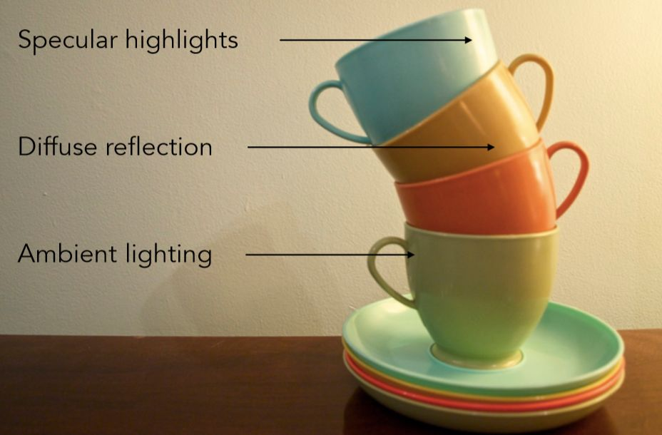
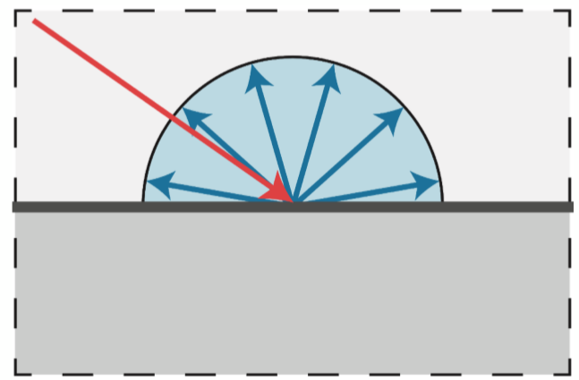
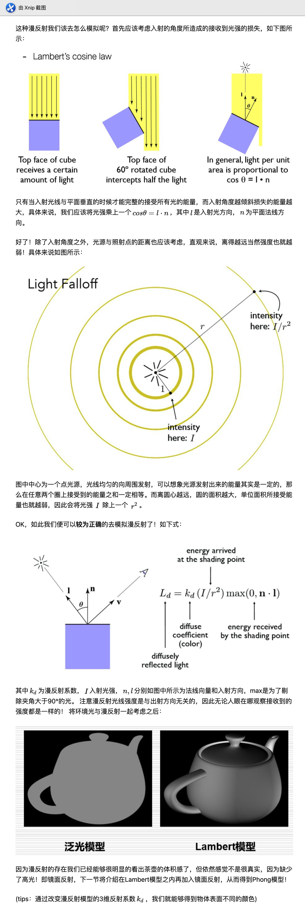
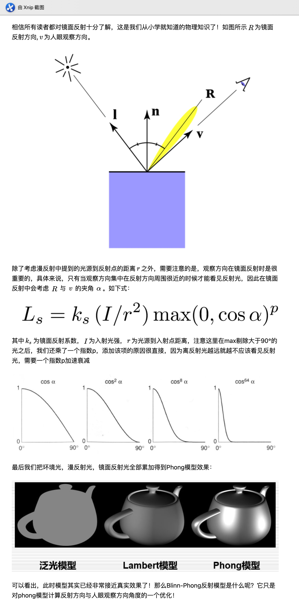

<!--
 * @Author: yangyanan 3288077283@qq.com
 * @Date: 2022-07-26 11:38:36
 * @LastEditors: yangyanan 3288077283@qq.com
 * @LastEditTime: 2022-07-26 13:42:28
 * @FilePath: /分享/webgl/笔记/03着色/01-概述.md
 * @Description: 这是默认设置,请设置`customMade`, 打开koroFileHeader查看配置 进行设置: https://github.com/OBKoro1/koro1FileHeader/wiki/%E9%85%8D%E7%BD%AE
-->
###
* 现实世界中有无数种颜色，每一个物体都有它们自己的颜色。我们要做的工作是使用(有限的)数字来模拟真实世界中(无限)的颜色，因此并不是所有的现实世界中的颜色都可以用数字来表示。然而我们依然可以用数字来代表许多种颜色，并且你甚至可能根本感觉不到他们与真实颜色之间的差异。颜色可以数字化的由红色(Red)、绿色(Green)和蓝色(Blue)三个分量组成，它们通常被缩写为RGB。这三个不同的分量组合在一起几乎可以表示存在的任何一种颜色。例如,要获取一个珊瑚红(Coral)颜色我们可以这样定义一个颜色向量: vec4(1.0,0.5,0.31,1.0);

* 我们在现实生活中看到某一物体的颜色并不是这个物体的真实颜色，而是它所反射(Reflected)的颜色。换句话说，那些不能被物体吸收(Absorb)的颜色(被反射的颜色)就是我们能够感知到的物体的颜色。例如,太阳光被认为是由许多不同的颜色组合成的白色光(如下图所示)。如果我们将白光照在一个蓝色的玩具上，这个蓝色的玩具会吸收白光中除了蓝色以外的所有颜色，不被吸收的蓝色光被反射到我们的眼中，使我们看到了一个蓝色的玩具。

### 光照基础
#### 1:我们为何能够看到物体？
* 在进入具体模型讲解之时，我们以该章标题的问题作为一个开始，其实问题的答案我想大家都知道，之所以物体能被我们观察，是因为人眼接收到了从物体来的光。 没错，这其实也就是局部光照模型的基础，可以具体看看究竟有几种类型光线能从物体到人眼呢？
;
* 如上图，可以先将光线简单的分为3类：
1. 镜面反射
2. 漫反射
3. 环境光

#### 2: 泛光模型
第一个， 泛光模型即只考虑环境光，这是最简单的经验模型，只会去考虑环境光的影响，并且不会去精确的描述，而只是用一个简单的式子表示
*  <环境光反射颜色> = <反射系数>*<环境光颜色>*<物体本身颜色>
;
没错，泛光模型只能让我们看到一个物体的平面形状，怎么能够有体积感呢，这就要添加漫反射了，即Lambert漫反射模型。
（tips：其中反射率还是光的亮度都是一个3维的RGB向量，为什么一个物体能够有颜色，其实就是它吸收了一定颜色的光，将剩下的光反射出来，也就有了颜色）

### 3: Lambert漫反射模型
* 所谓Lambert漫反射模型其实就是在泛光模型的基础之上增加了漫反射项。漫反射便是光从一定角度入射之后从入射点向四面八方反射，且每个不同方向反射的光的强度相等，而产生漫反射的原因是物体表面的粗糙，导致了这种物理现象的发生。
;
;
### 4:phong光照模型
;

