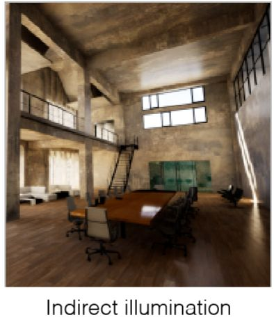

<!--
 * @Author: yangyanan 3288077283@qq.com
 * @Date: 2022-07-26 13:44:36
 * @LastEditors: yangyanan 3288077283@qq.com
 * @LastEditTime: 2022-07-26 14:34:35
 * @FilePath: /分享/webgl/笔记/03着色/光照/02-Whitted-Style光线追踪原理详解及实现细节.md
 * @Description: 这是默认设置,请设置`customMade`, 打开koroFileHeader查看配置 进行设置: https://github.com/OBKoro1/koro1FileHeader/wiki/%E9%85%8D%E7%BD%AE
-->
[全局光照发展史](https://www.pianshen.com/article/9391997170/);
# Whitted-style光线追踪原理及其实现细节
全局光照 = 直接光照(Direct Light) + 间接光照(Indirect Light)
## 本篇内容主要分为两部分，
* 第一部分会从为什么需要光线追踪入手，一步步介绍Whitted-style光线追踪的原理。
* 第二部分则会具体介绍一些光线追踪的实现细节，包括光线的表示，光线与物体的求交，以及反射折射方向的计算。
### 1 Whitted-Style 光线追踪
在进入原理讲解之前，我们首先考虑一下为什么需要光线追踪呢？ 因为Blinn-Phong这种局部模型无法处理全局效果！ 举个例子：
;

* 如上图中房屋顶部的所接受到的光可不仅仅是Blinn-Phong模型考虑的直接光源，还有可能是来自窗外的光源照射到地板，再发生反射照射到了房屋顶部，而这部分光是局部光照模型没有考虑到的，而光线追踪正是为了解决这种问题所提出的一种考虑全局效果的光照模型。
* [whitted-style](https://blog.csdn.net/weixin_46954788/article/details/121769336)

